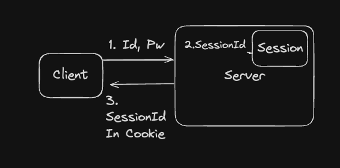
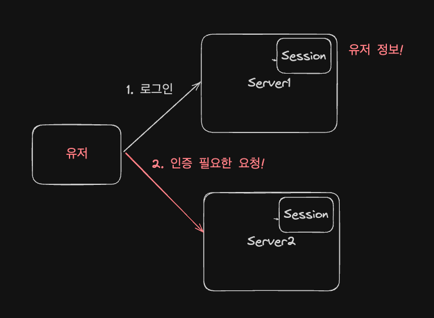

안녕하세요 Road Of Programmer를 개발하고 있는 `Hack`입니다.  
오늘은 프로젝트의 인증과 인가를 구현하면서 공부한 내용을 정리하고자 합니다.

## 👋 인증과 인가에 대하여
로그인은 접속한 사용자를 구분하여 웹 어플리케이션의 `리소스(데이터)`에 대한 접근 권한을 조절하기 위해서 주로 사용합니다.  
로그인에서는 `인증과 인가` 2가지 개념으로 구분하여 사용자의 요청을 처리합니다.  

### 인증(Authentication)이란?
인증이란 요청한 사용자가 본인이 맞는지 확인하는 절차를 말합니다.  
일반적인 웹사이트의 흐름대로라면 사용자는 아이디와 비밀번호를 이용하여 요청을 보내는 사람이 아이디의 주인임을 증명합니다.  

인증 절차가 까다로운 어플리케이션의 경우에는 OTP, 2차비밀번호 지문등의 인증을 위한 추가적인 정보를 사용하기도 합니다.  

중요한 점은 인증이 끝난 사용자는 서버로부터 `인증된 사용자임을 증명할 값`을 받게 된다는 점입니다.

### 인가(Authorization)란?
인가란 인증된 사용자가 요청한 자원에 접근 가능한지를 확인하는 절차를 말합니다.  
이러한 절차는 `허락되지 않은 사용자가 시스템의 자원을 무분별하게 조작하는 것을 막기 위해`서 필요합니다.  
아무런 관련도 없는 사용자가 프로그램의 데이터를 모두 지울 권한을 주면 당연히 안될 것입니다.

보편적으로 인가를 구현하기 위해서는 회원 데이터에 권한과 관련된 데이터를 같이 사용하는 방식으로 유저의 권한을 구별합니다.

## 인증과 인가를 구현하는 여러가지 방법
제가 사용자로서 경험한 인증 인가를 방법에 대해서 간단하게 나열 해 보겠습니다.

1. 아이디와 비밀번호를 이용한 인증
2. 지문을 이용한 인증(카카오 페이, 카카오 뱅크 등)
3. 2차 비밀번호 OTP를 이용한 인증(게임, AWS)
4. API키를 이용한 인증 (Slack Web Hook)

이렇듯 인증을 구현하기 위한 방법은 참 많은 것 같습니다.  
이번 글에서는 2번 3번 4번은 다루지 않고 1번에 대해서 조금 더 다뤄보도록 하겠습니다.

### 1. 쿠키와 세션

  
쿠키와 세션을 이용한 로그인 방식은 아래와 같은 절차를 가집니다.

1. 사용자는 아이디와 비밀번호를 서버로 전송한다.
2. 서버는 아이디와 비밀번호를 이용하여 인증을 진행한다.
3. 인증이 성공했을 경우 세션에 유저의 정보를 저장한다 `{세션키: 유저 정보}`
4. 서버는 쿠키에 세션아이디를 넣어준다.
5. 이후 요청에는 쿠키에 세션아이디를 포함하여 요청하면 세션에 있는 유저 정보를 활용한다.

### 다중 서버 환경에서 쿠키와 세션

단일 서버에서는 문제가 없지만 다중 서버에서 쿠키와 세션을 활용할 경우 각 서버간의 세션 불일치 문제가 발생 할 수 있습니다.

1. 유저가 1번 서버에 로그인 요청을합니다. 1번 서버의 세션에는 유저 정보가 생성됩니다.
2. 로그인한 유저가 2번 서버에 인증이 필요한 요청을 합니다.
3. 2번 서버의 세션에는 유저의 정보가 존재하지 않기 때문에 인증이 필요하다는 응답을 줍니다.

다중 서버에서 세션 불일치 문제를 해결하기 위한 여러가지 방법이 있습니다.

#### 스티키 세션

로드밸런서가 세션 기간 동안 동일한 클라이언트의 요청을 동일한 서버로 라우팅 해주는 기능을 이용하면 세션 불일치 문제를 해결 할 수 있습니다.  
단점으로는, 특정 서버에 트래픽이 과부하 될 수 있다는 단점이 있습니다.

#### 글로벌 세션

다음으로는 글로벌 세션을 이용한 방식이 있습니다.  
서버 내부에 있던 세션 저장소의 역할을 외부 저장소로 빼낸 방식입니다.  
서버가 외부 세션 서버를 이용해 세션 상태를 공유하기 때문에 데이터의 정합성을 신경쓸 필요가 없습니다.  

물론 하나의 세션 서버로 부하를 감당하지 못한다면 세션서버를 다중화하고 세션 데이터를 동기화 해야 하는 문제가 다시 발생하게 됩니다.

### 2. HTTP Basic
다음은 HTTP Basic인증입니다.  
HTTP Basic인증은 Authorization 헤더에 bas64로 인코딩된 사용자 ID와 비밀번호를 입력하여 인증을 진행합니다.   

> Authorization: Basic base64({USERNAME}:{PASSWORD})

 

Basic 인증 방식의 경우 간단한 인증 절차를 가지고 있지만 보안에 취약하다는 단점을 가지고 있기 때문에 HTTPS를 반드시 적용해야 합니다.  

### 3. HTTP Bearer
Bearer 인증 방식은 OAuth 2.0 프레임워크에서 사용하는 토큰인증 방식입니다.  

> Authorization: Bearer <token>

#### OAuth2.0 
OAuth 프레임워크는 다양한 서비스 또는 서버사이에서 안전하게 데이터를 전송하기 위한 프레임워크입니다.  
제 3자의 클라이언트에게 보호된 리소스를 제한적으로 접근할 수 있게 도와줍니다.

(그림 출처: 토스 블로그)  

- 리소스 소유자: 사용자
- 클라이언트: 사용자의 정보를 접근하는 제 3자의 서비스
- 인증 서버: 클라이언트의 접근을 관리하는 서버
- 리소스 서버: 리소스 소유자의 데이터를 관리하는 서버

#### Bearer 토큰
Bearer 토큰은 OAuth 프레임워크에서 액세스 토큰으로 사용하는 토큰의 유형입니다.  
액세스 토큰은 클라이언트가 해석할 수 없는 형태여야 하며 사용자의 정보를 전달해서도 안되며 서버에서 클라이언트의 권한을 확인할 수 있는 메타데이터가 토큰에 인코딩 되어 있어야 합니다.

### Basic 토큰에 Bearer토큰 처럼 권한을 인코딩하면 뭐가 다른거죠??

> Authorization: Basic base64({USERNAME}:{PASSWORD}:{Authorization})

토큰에 대해서 공부하다보니, Basic 토큰을 사용하는 방식에 권한을 인코딩하면 Bearer토큰과 뭐가 다른걸까 고민을 해봤습니다.

1. 결과적으로 Bearer 토큰과 달라지지 않는다.
2. 하지만 [RFC7617](https://datatracker.ietf.org/doc/html/rfc7617) 표준에 맞지 않는 방식이고 이는 표준이라기 보다는 커스텀 헤더 처럼 사용하는 것과 다를 바 없다.
3. Authorization 헤더는 기본적으로 인증을 위한 헤더이지 인가를 위한 헤더는 아니다 인증과 인가는 구분되어야 한다.
4. [RFC6750](https://datatracker.ietf.org/doc/html/rfc6750)에 따르면 `Bearer 토큰은 OAuth2.0의 보호된 자원에 접근하기 위한 토큰`이다.
5. OAuth2는 `다양한 서비스 또는 서버사이에서 데이터를 전송하기 위해 만들어진 프로토콜`이기 때문에 `리소스를 제한적으로 접근할 수 있게 하기 위한 정보가 필요`하고 이를 Bearer토큰에 넣는 방식을 선택한 것 같다.
6. 결론적으로 Basic 토큰과 Bearer토큰은 애초에 만들어진 목적 자체가 다르다.

확실하지는 않지만 일단은 이정도로 결론을 내고 넘어가야 할 것 같습니다..

### 토큰 인증 방식의 문제점과 개선
세션방식과는 달리 한번 발급된 토큰을 무효화 시키기 위해서 데이터베이스에 `무효화된 토큰` 리스트를 저장하는 등의 추가적인 처리가 필요합니다.   

토큰을 무효화시키지 않고 액세스 토큰의 주기를 매우 짧게 설정하고 `리프래쉬 토큰`을 같이 발급하는 등의 형태를 통해서 토큰이 탈취될 경우를 대비 할 수 있습니다.

### 리프래쉬 토큰이나 블랙리스트 토큰이나 저장소를 사용하는거 아닌가요?
네 맞습니다.  
토큰인증 방식의 장점 중 하나인 서버에 `세션을 유지할 필요가 없다는 장점을 살짝 포기하고 보안을 챙기는 방식`이라고 생각하면 될 것 같습니다.
  
세션은 매 요청마다 전역상태를 참조하지만 리프래쉬 토큰 같은 경우 토큰이 유효하지 않을 때만 전역 상태를 참조하기 때문에 세션방식보다는 stateless하게 서버를 유지 할 수 있다는 장점을 유지 할 수 있습니다.

## 결론

이번 프로젝트에서는 HTTPS accessToken, refreshToken을 조합하여 인증을 구현하겠습니다.

1. HTTPS와 refreshToken 조합을 사용하여 토큰인증 방식의 보안상의 문제점을 개선
2. 토큰기반 인증 방식이기 때문에 무상태에 가까운 상태로 인증 설계 가능
3. 토큰을 재발급 받는 동안에 사용하는 상태는 쿠키 세션 방식보다는 글로벌 토큰저장소의 부하가 더 적음

#### 참고
https://mangkyu.tistory.com/76  
https://velog.io/@tosspayments/Basic-%EC%9D%B8%EC%A6%9D%EA%B3%BC-Bearer-%EC%9D%B8%EC%A6%9D%EC%9D%98-%EB%AA%A8%EB%93%A0-%EA%B2%83  
https://tjdrnr05571.tistory.com/3?category=876333