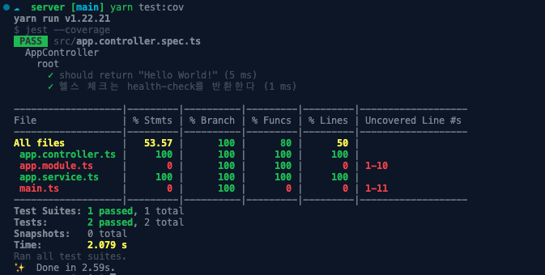
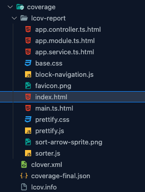
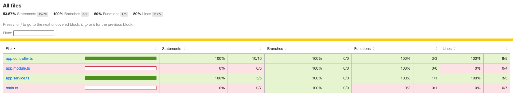
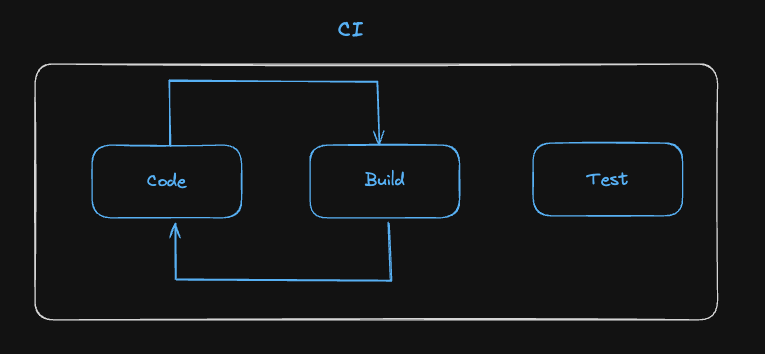
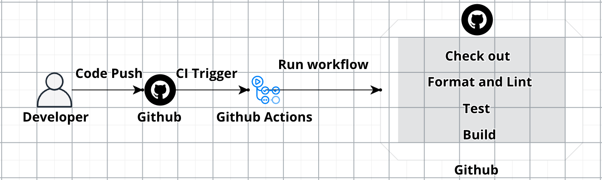

## 도입

안녕하세요, Road Of Programmer를 개발하고 있는 Hack입니다.  
프로젝트를 개발하면서 테스트코드를 작성하기로 했고 이를 위한 CI 환경을 구성할 예정입니다.  
환경을 구성하기에 앞서 테스트코드의 개념과 테스트 작성방식 그리고 CI 환경에 대해 사전 조사를 진행하였고 조사한 내용을 글로 정리 해보려고 합니다.

## 테스트 코드란?

테스트란 프로그램을 실행하여 개발자가 원하는 대로 동작하는지 확인 하는 것을 말합니다.  
이러한 일련의 절차를 `코드로 작성하여 자동화`하면 많은 기능에 대해서 수동으로 테스트 하는 시간을 줄일 수 있습니다.  
자동화된 테스트는 코드 수정에 `심리적인 안정감`을 줄 수 있기 때문에 프로젝트에 도입하기로 결정 했습니다.

### 유닛(단위) 테스트란?

개발자가 수행하고 자신이 개발 한 코드 단위를 테스트하는 방법입니다.  
소스코드의 `개별 단위(주로 메소드)`를 테스트하여 사용할 준비가 되었는지 확인합니다.  
개발 초기에 버그를 식별하는데 도움이되어 버그 수정 시간을 줄이는데 도움을 줍니다.

#### 단위 테스트의 조건

- 단위 테스트는 독립적이어야 하며, 어떤 테스트도 다른 테스트에 의존해서는 안됩니다.
- 외부 의존성과 격리되어야 합니다.

### 통합 테스트란?

통합 테스트는 단위 테스트보다 큰 범위의 테스트를 의미하며 애플리케이션의 여러 부분을 통합하여 제대로 상호작용 되는지 테스트합니다.  
단위 테스트가 하나의 메소드를 테스트한다면 통합테스트는 하나의 메소드가 의존하는 다른 의존성까지 테스트를 하게 됩니다.

### E2E 테스트란?

End to End 테스트의 약자로 실제 사용자가 사용하는 것과 같은 조건에서 테스트를 말합니다.
실제 사용자 시나리오를 가지고 테스트를 진행합니다.  
주로 Cypress Puppeteer 같은 툴을 이용하여 자동화된 테스트를 진행합니다.

> 공부하면서 내용을 정리하긴 했지만 원래 통합테스트와 E2E 테스트의 구분이 모호한 것인지 차이점을 잘 몰르겠습니다..🤔  
> 그래서 이번 프로젝트에서는 통합테스트 E2E테스트를 구분하지 않고 E2E테스트(컨트롤러 -> DB) 단위 테스트를 조합해서 활용하기로 했습니다.

### 테스트 커버리지란

테스트 커버리지란 수행한 테스트가 테스트의 대상을 어느정도 커버했는지를 나타내는 지표입니다.  
커버리지 지표로는 얼마나 커버했느냐에 따라 기준을 나눕니다.

- 구문 커버리지
- 결정 커버리지
- 조건 커버리지

#### 구문 커버리지

```ts
function(a: number) {
    console.log('hi'); // 1
    if(a > 0) { // 2
        a = 2; // 3
    } // 4
    print('hi') // 5
}
```

모든 코드가 실행되었는지를 확인합니다.  
위 코드의 경우 `a가 음수일 경우` if문 내부는 사용되지 않기 때문에 커버리지에서 제외합니다.

#### 결정(브랜치) 커버리지

```ts
function(a: number, b: number) {
    if(a > 0 && b > 0) {
        console.log('hi~')
    }
}
```

외부 조건에 대하여 True/false를 가지게 되면 만족합니다.
위 코드에서는 `a > 0 && b >0`인 부분의 조건식이 true, false인 두 가지 경우를 모두 테스트해야 브랜치 커버리지가 충족됩니다.

#### 조건커버리지

```ts
function(a: number, b: number) {
    if(a > 0 && b < 0) {
        console.log('hi~')
    }
}
```

모든 내부조건에 대해 True/False를 가지게 되면 만족합니다.  
위 코드에서 `a > 0` `b < 0`은 내부 조건이며 각 조건이 true/false인 경우가 있으면 조건 커버리지를 만족합니다.

`a=1, b=1` `a=-1 b=-1`인 코드를 테스트한다고 가정 해보겠습니다.  
내부 조건식 `a>0`과 `b<0`은 모두 양수 음수일때가 존재하므로 조건 커버리지를 만족합니다.

하지만 2가지 경우 모두 `a > 0 && b < 0`의 결과가 false이기 때문에 결과적으로 조건문 내부는 테스트하지 못하게 됩니다.

### Nest에서 커버리지를 측정하는 방법

Nestjs에서는 기본적으로 커버리지를 측정하는 방법(jest)을 제공합니다.

```json
  "scripts": {
    "build": "nest build",
    "format": "prettier --write \"src/**/*.ts\" \"test/**/*.ts\"",
    "start": "nest start",
    "start:dev": "nest start --watch",
    "start:debug": "nest start --debug --watch",
    "start:prod": "node dist/main",
    "lint": "eslint \"{src,apps,libs,test}/**/*.ts\" --fix",
    "test": "jest",
    "test:watch": "jest --watch",
    "test:cov": "jest --coverage",
    "test:debug": "node --inspect-brk -r tsconfig-paths/register -r ts-node/register node_modules/.bin/jest --runInBand",
    "test:e2e": "jest --config ./test/jest-e2e.json"
  }
```

위에 보이는 json은 nestjs의 프로젝트를 생성하면 보이는 package.json파일입니다.  
해당 프로젝트에서 아래와 같은 코드를 실행하면 커버리지를 측정합니다.

```sh
yarn test:cov
```

<br/>
<br/>

  
위 화면은 커버리지가 측정된 결과입니다.

<br/>
<br/>


커버리지가 측정되고 난 후에는 위와 같은 위치에 html로 된 보고서가 생깁니다.

<br/>
<br/>


해당 보고서를 열어보면 커버리지 측정 결과를 웹에서도 확인 하실 수 있습니다.

## CI란?



CI란 여러 개발자의 코드 변경 사항을 공유 저장소에 지속적으로 통합하는 것을 말합니다.  
제가 이해한 바로는 코드를 단순히 통합하는 것이 아닌, 테스트를 자동화하고, 코드를 통합하기 전 테스트를 자동화하고, 정적분석을 실행하는 일련의 코드퀄리티를 보장하는 작업을 자동화하며 코드를 통합하는 것을 말합니다.

CI를 통해 통합된 코드는 테스트 및 정적분석등 일련의 코드 퀄리티를 보장하는 작업이 수행된 코드이기 때문에 개발자는 안정적인 마음으로 배포를 수행할 수 있습니다.

## Github Actions란?

> GitHub Actions를 사용하여 리포지토리에서 바로 소프트웨어 개발 워크플로를 자동화, 사용자 지정 및 실행합니다. CI/CD를 포함하여 원하는 작업을 수행하기 위한 작업을 검색, 생성 및 공유하고 완전히 사용자 정의된 워크플로에서 작업을 결합할 수 있습니다.

Github Actions란 Github에서 제공하는 워크플로우를 자동화하는 툴입니다.  
공개 저장소일 경우 `무료`로 사용할 수 있으며 다양한 플러그인을 제공하여 쉽게 CI환경을 구성할 수 있다는 장점이 있습니다.

## Github Actions를 이용하여 CI 환경 구성하기

```yml
name: Server CI

on:
  push:
    branches: ['main']
  pull_request:
    branches: ['main']

jobs:
  build:
    runs-on: ubuntu-latest

    strategy:
      matrix:
        node-version: [21.x] # 워크 플로우에서 사용할 노드 버전

    env:
      working-directory: ./server #서버 폴더에서 명령을 실행시키기 위한 환경 변수

    steps:
      - uses: actions/checkout@v3
      - name: Use Node.js ${{ matrix.node-version }}
        uses: actions/setup-node@v3
        with:
          node-version: ${{ matrix.node-version }}
          cache: 'yarn'
          cache-dependency-path: ./server/yarn.lock #의존성을 읽기 위해 yarn.lock파일 지정
      # 의존성 설치
      - name: Download Dependency
        run: yarn install
        working-directory: ${{ env.working-directory }}
      # 코드 자동 포매팅
      - name: Formatting By prettier
        run: yarn format
        working-directory: ${{ env.working-directory }}
      # 린트 검사
      - name: Lint By Eslint
        run: yarn lint
        working-directory: ${{ env.working-directory }}
      # 테스트 수행
      - name: Test
        run: yarn test
        working-directory: ${{ env.working-directory }}
```

위 코드는 해당 프로젝트의 서버에서 임시적으로 사용하고 있는 CI파이프라인입니다.  
main브렌치에 코드가 푸쉬되거나 PR이 올라올 경우 CI가 돌아가면서 코드에 대한 린트와 포메팅 과정을 거치고 테스트를 수행합니다.

## CI 과정 요약



그래서 현재 프로젝트의 파이프 라인은 위 그림과 같은데요 ㅎㅎ  
개발이 조금더 진행되고 배포플랫폼을 명확히 결정하게 되면 CD까지 포함한 글로 찾아뵙겠습니다.  
감사합니다

### 참고자료

https://err0rcode7.github.io/backend/2021/05/11/%ED%85%8C%EC%8A%A4%ED%8A%B8%EC%BB%A4%EB%B2%84%EB%A6%AC%EC%A7%80.html

```toc

```
