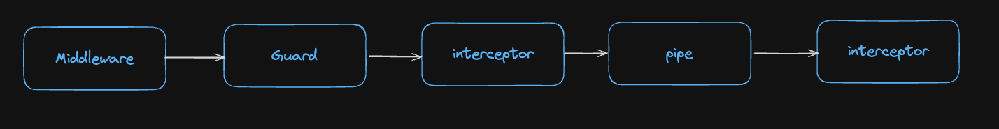
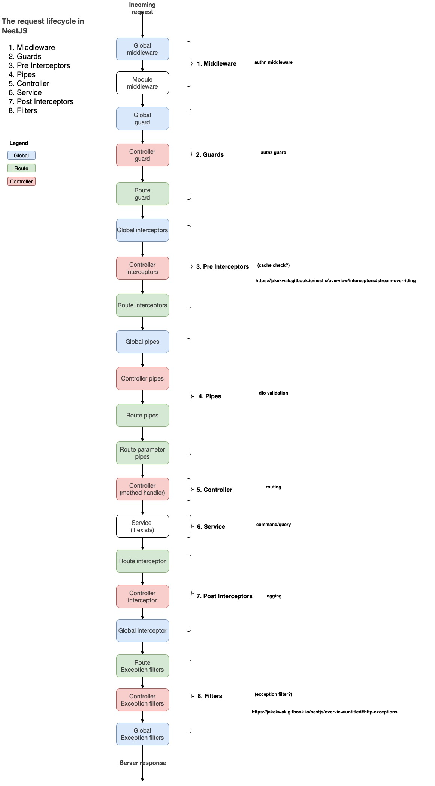

## 도입

안녕하세요👋 Road Of Programmer를 개발하고 있는 Hack입니다.  
프로젝트 로깅 관련 설정을 진행하던 중 nestjs의 인터셉터 기능을 활용하게 되었습니다.  
구현을 하다보니 nestjs에서는 요청과 응답 라이프사이클에서 공통적으로 수행할 수 있는 코드를 `middleware` `pipe` `interceptor`
를 이용하여 중복을 줄일 수 있다는 것을 알게 되었고 이를 정리하기로 했습니다.

## Nestjs Request lifecycle


공식문서에 따르면 NestJs에서 요청흐름은 middleware -> guard ->interceptor -> pipe -> interceptor(응답이 나간 후)
의 흐름으로 진행됩니다.  
위에서 설명한 컴포넌트는 기술적으로 모두 NodeJS에서 말하는 Middleware에 속하지만, Nestjs에서는 Guard, Interceptor, Pipe Filter를 모두 enhancer라고 부르며 enhancer를 쓰기를 권장하고 있습니다.

## Middleware

클라이언트에서 요청이 오면 `중간`에 `목적에 맞게 처리하는 함수`를 말합니다.  
Nestjs에서는 전역 미들웨어와 특정 모듈에 설정된 미들웨어 2가지 종류의 미들웨어가 존재합니다.  
미들웨어는 루트 모듈에 설정된 미들웨어가 먼저 수행됩니다.  
이번 프로젝트에서 Logger를 미들웨어에 구현 했는데 Guard에 들어가기 전부터 로그를 남기고 싶어서 미들웨어를 이용 했습니다.

## Guards

Nestjs에서 제공하는 enhancer middleware중 하나로 주로 `인증`과 `인가`를 구현하는데 도움이 되는 기능을 포함합니다.

## Interceptors

Nestjs에서 제공하는 enhancer middleware중 하나로 요청을 `받은 후`와 `응답을 내보내기전` 추가적인 로직이 필요한 경우 주로 사용합니다.  
이번 프로젝트에서는 Sentry로 에러 정보를 보내고 slack 알람을 발생시키는데 사용 했습니다.

## Pipes

Nestjs에서 제공하는 enhancer middleware중 하나로 사용자의 요청 속 `데이터를 변경 및 검증` 하는데 주로 사용합니다.

## 전체 요청 흐름



1. 요청이 들어옵니다.

2. middleware를 타면서 request와 response 중간에 로직을 추가합니다.

3. Guard를 지납니다. 주로 인증과 인가에 대한 처리를 해줍니다.

4. Pre Interceptor를 거치게 됩니다. Interceptor는 요청과 응답 중간에 로직을 추가합니다.

5. Pipe를 거치게 됩니다. Pipe는 요청이 왔을 때 Body나 Params, query에 대해 validation transformation을 해줍니다.

6. 컨트롤러를 지납니다.

7. 서비스를 실행합니다.

8. Post Interceptor를 거칩니다.

9. Exception filter를 거치고 400, 500번대 에러에 대한 에러 처리를 합니다. 일반적으로 Global Exception Filter를 이용해 에러에 대한 핸들링을 합니다.

## 참고자료

https://docs.nestjs.com/faq/request-lifecycle  
https://blog-ko.superb-ai.com/nestjs-interceptor-and-lifecycle/

```toc

```
